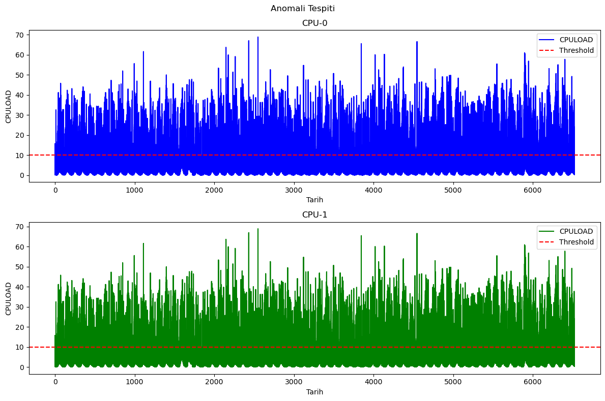

# ⚙️ CPU Load Prediction & Anomaly Detection with Machine Learning

This repository presents a **comprehensive machine learning pipeline for CPU load forecasting and anomaly detection**, developed within the scope of **İnnova Install Future Program – AI Data Competition (2023)**.

The project focuses on **time-series based prediction of CPU utilization** for multiple devices and **detecting anomalous CPU behavior** using historical operational data. The entire workflow—from data preprocessing to modeling, evaluation, and visualization—is implemented and documented in a **fully reproducible Jupyter Notebook (`.ipynb`)**, which is included in this repository.

---

## 📌 Project Objective

The competition task is two-fold:

1. **CPU Load Prediction**  
   Using data collected between **March 24 – May 30, 2020**, predict the **average CPU load (CPULOAD)** for each device on **May 31, 2020**, at **15-minute intervals (00:00–23:59)**.

2. **Anomaly Detection**  
   Using data from **May 15 – May 30, 2020**, identify **anomalous behavior patterns** in CPU usage for each device.

In short, the project aims to:
- Perform **fine-grained CPU load forecasting**
- Detect **abnormal system behavior** that may indicate performance issues, misconfigurations, or failures

---

## 🧠 Methodological Overview

This project treats CPU utilization as a **multivariate time-series problem** and follows a structured ML workflow:

- Exploratory Data Analysis (EDA) on per-device CPU load trends  
- Time-based feature engineering (lags, rolling statistics, temporal patterns)  
- Supervised learning models for **CPU load regression**  
- Residual-based and statistical approaches for **anomaly detection**  
- Clear and interpretable **visual analytics** for anomaly inspection  

All modeling, experimentation, and analysis steps are implemented in the provided **Jupyter Notebook**, making the project easy to audit, reproduce, and extend.

---

## 📂 Repository Structure

- **`cpu_load_predict.ipynb`**  
  The main notebook containing:
  - Data loading & preprocessing  
  - Feature engineering  
  - Model training and evaluation  
  - CPU load prediction results  
  - Anomaly detection logic  
  - Visualization of anomalies and trends  

- **`images/output.png`**  
  Visualization output demonstrating **anomaly detection results**, where abnormal CPU load behaviors are highlighted over time for selected devices.

---

## 📈 Anomaly Detection Visualization

Anomaly detection results are visualized to provide **human-interpretable insights** into system behavior.

The following figure illustrates how anomalies in CPU load are detected and highlighted over time:

This visualization approach allows:
- Rapid identification of abnormal CPU usage patterns  
- Comparison between expected (predicted) and observed behavior  
- Practical interpretability for system operators and engineers  

---

## 🧪 Modeling & Analysis Highlights

- Time-series aware feature engineering  
- Per-device modeling strategy  
- Emphasis on **temporal consistency and generalization**  
- Residual-based anomaly scoring  
- Clear separation of normal vs anomalous CPU behavior  

The notebook-driven approach ensures that **every step is transparent**, from raw data to final insights.

---

## 🛠️ Technologies Used

- **Programming Language:** Python  
- **Environment:** Jupyter Notebook  
- **Core Libraries:**  
  - NumPy, Pandas  
  - Scikit-learn  
  - Matplotlib / Seaborn  

---

## 🎯 Key Contributions

✔ End-to-end CPU load forecasting pipeline  
✔ Time-series oriented machine learning approach  
✔ Practical anomaly detection strategy  
✔ Clear and effective anomaly visualizations  
✔ Fully reproducible and well-documented notebook-based implementation  

---

## 🔬 Conclusion

This project demonstrates how **machine learning can be effectively applied to system monitoring problems**, combining **predictive modeling** with **anomaly detection** to deliver actionable insights.

The solution is suitable for:
- Data centers  
- Cloud infrastructure monitoring  
- Enterprise IT operations  
- Predictive maintenance and capacity planning  

The repository is designed to be **readable, extendable, and production-oriented**, making it a strong reference implementation for CPU load analysis tasks.

---

## 📬 Contact

**Furkan Karakaya**  
AI & Computer Vision Engineer  
📧 se.furkankarakaya@gmail.com  

---

⭐ If you find this project useful, consider starring the repository!
